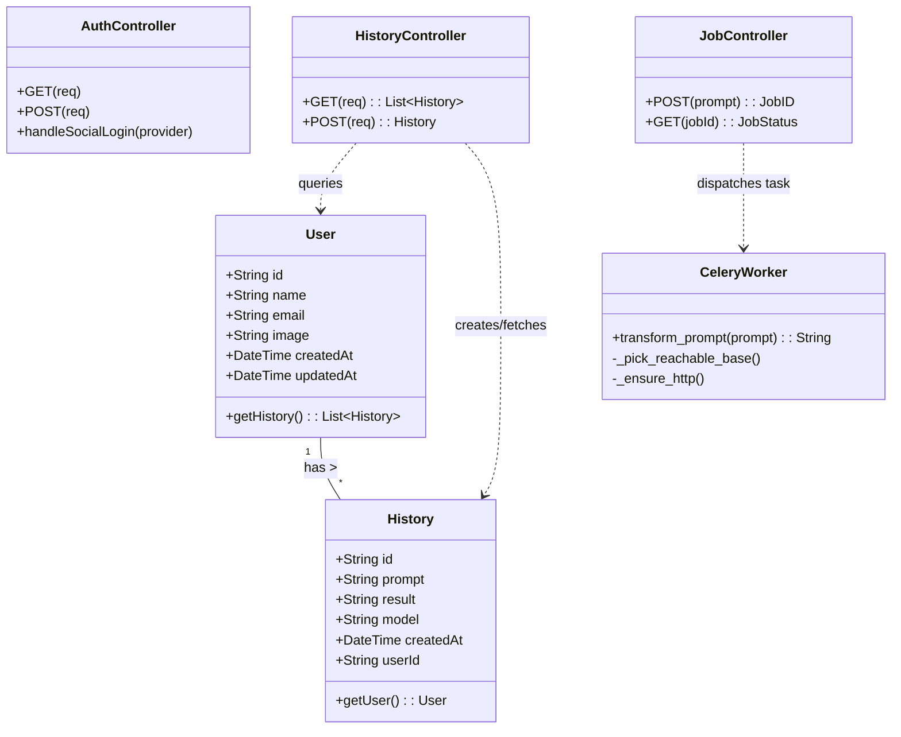

# API & Data Model UML (OOP)

```mermaid
classDiagram
    class User {
        +String id
        +String name
        +String email
        +String image
        +DateTime createdAt
        +DateTime updatedAt
        +getHistory() : List~History~
    }

    class History {
        +String id
        +String prompt
        +String result
        +String model
        +DateTime createdAt
        +String userId
        +getUser() : User
    }

    class AuthController {
        +GET(req)
        +POST(req)
        +handleSocialLogin(provider)
    }

    class HistoryController {
        +GET(req) : List~History~
        +POST(req) : History
    }

    class JobController {
        +POST(prompt) : JobID
        +GET(jobId) : JobStatus
    }

    class CeleryWorker {
        +transform_prompt(prompt) : String
        -_pick_reachable_base()
        -_ensure_http()
    }

    User "1" -- "*" History : has >
    HistoryController ..> User : queries
    HistoryController ..> History : creates/fetches
    JobController ..> CeleryWorker : dispatches task
```
